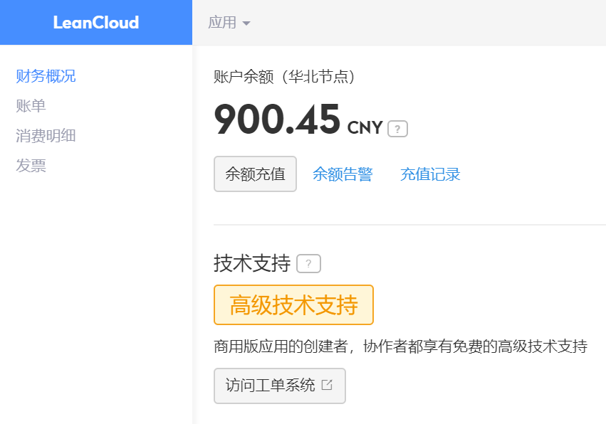

# 援助武汉 RESTful API

基于 [Koa][1]、[TypeScript][2] 和 [TypeORM][3] 的 **Node.js 后端**项目脚手架

[][4]

## 主要特性

1. [LeanCloud 手机短信验证码登录](source/controller/Session.ts)
2. [角色管理](source/controller/Role.ts)
3. [用户管理](source/controller/User.ts)
4. [文件管理](source/controller/File.ts)
5. [物资需求管理](source/controller/SuppliesRequirement.ts)
6. [物流管理](source/controller/Logistics.ts)
7. [酒店管理](source/controller/Hotel.ts)
8. [供应商管理](source/controller/Vendor.ts)
9. [义诊管理](source/controller/Clinic.ts)
10. [捐款接收方管理](source/controller/DonationRecipient.ts)
11. [疫情数据查询](source/controller/Epidemic.ts)

## 环境变量

|            名称            |            用途             |
| :------------------------: | :-------------------------: |
|        `APP_SECRET`        |       加密密码和令牌        |
|       `DATABASE_URL`       |    PostgreSQL 连接字符串    |
|    `LEANCLOUD_API_HOST`    | [LeanCloud][5] API 主机地址 |
|     `LEANCLOUD_APP_ID`     |      LeanCloud 应用 ID      |
|    `LEANCLOUD_APP_KEY`     |     LeanCloud 应用 Key      |
|     `AWS_S3_END_POINT`     |    [AWS S3][6] 端点地址     |
|      `AWS_S3_BUCKET`       |      AWS S3 存储桶名称      |
|   `AWS_S3_ACCESS_KEY_ID`   |     AWS S3 访问密钥 ID      |
| `AWS_S3_SECRET_ACCESS_KEY` |       AWS S3 访问密钥       |
|    `AWS_S3_PUBLIC_HOST`    |       AWS S3 公共主机       |

## 本地开发

1. 安装 [Node.js](https://nodejs.org/en/download/package-manager/)

2. `git clone https://github.com/wuhan2020/rest-api.git`

3. [生成 GitHub 个人访问令牌][7]，并以 `GH_PAT` 为变量名存入项目根目录的 `.env.personal.local` 文件

4. 在本项目文件夹执行安装命令后启动

```shell
npm i pnpm -g
pnpm i
pnpm dev
```

5. 也可在 VS Code 中按 <kbd>F5</kbd>，以**调试模式**启动

## 部署

### 启动生产环境

```shell
npm start
```

### 数据迁移

```shell
pnpm upgrade:pro
```

### Docker

```shell
pnpm pack-image
pnpm container
```

## 发布

### 部署应用

```shell
git checkout master
git tag v2.0.0  # 版本号来自 ./package.json
git push origin master --tags
```

### 发布类型包

```shell
git checkout master
git tag type-v2.0.0  # 版本号来自 ./type/package.json
git push origin master --tags
```

## 测试数据

- 地址：https://vsw505fxbitp.leanapp.cn

- 手机号：`19949484787`

- 短信验证码：`003754`

## 特别感谢

[freeCodeCamp 成都社区][8]捐助 ￥ 900 用于购买 **LeanCloud 商业版**一个月，以支撑**每日超 3 万次**的 API 访问。



[1]: https://koajs.com/
[2]: https://www.typescriptlang.org/
[3]: https://typeorm.io/
[4]: https://github.com/wuhan2020/rest-api/actions/workflows/publish-type.yml
[5]: https://leancloud.cn/
[6]: https://aws.amazon.com/s3/
[7]: type/ReadMe.md
[8]: https://fcc-cd.dev/
